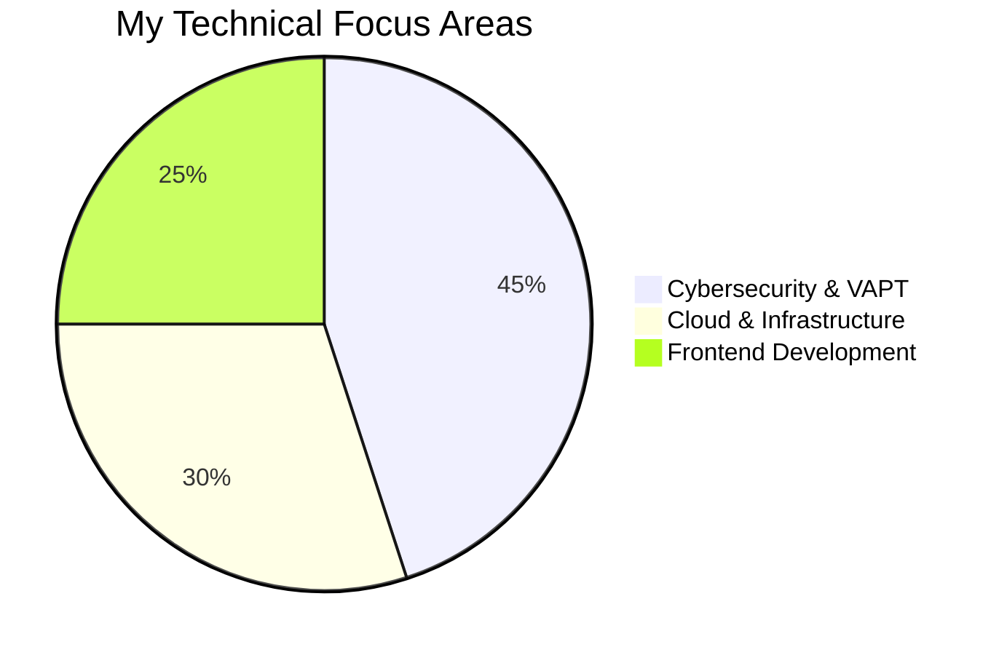
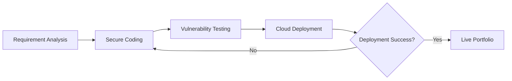

# 🌐 Interactive Digital Resume & Portfolio

---

## 🎯 Profile Overview
I am a dedicated **Cybersecurity and Cloud Infrastructure** professional. I build secure systems and interactive digital experiences.

👉 **[VIEW MY LIVE PORTFOLIO](https://pratikshaprabhakarbande.github.io/Interactive-Digital-Resume/)**

---

## 📊 Technical Expertise Distribution
*A snapshot of my core focus areas in cybersecurity and development.*

🚀 My Professional Workflow
How I approach projects from conception to deployment.

🛠️ Key Skills
Security: VAPT, Threat Hunting, Incident Response.
Tech Stack: Python, JavaScript, OCI, Docker.

📧 Let's Collaborate
GitHub: @Pratikshaprabhakarbande
Goal: Seeking innovative roles in Cybersecurity and Cloud Engineering.
Designed, coded, and deployed by Pratiksha Bande.
